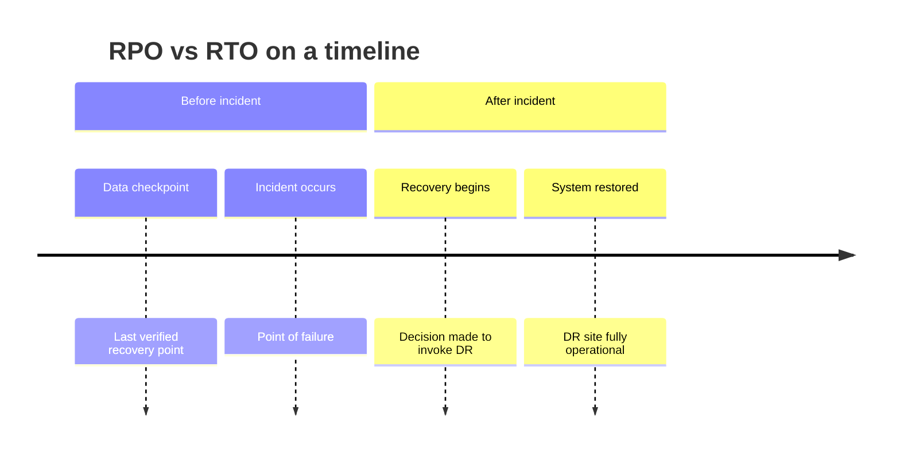

**Type:** Learn  
**Tools:** None (conceptual)  
**Prerequisites:** None  
**Time:** ~45 min  
**Chapter:** 00 — DR Fundamentals

# RPO vs RTO — the measurement problem

## Motto

*You can't protect what you haven't measured.*

## The Problem

Most organisations have RPO and RTO targets. Almost none of them can tell you — right now, at this moment — whether they're actually meeting them.

The targets exist as numbers in a DR policy document. Someone wrote them down years ago. They may have been based on gut feel, what the vendor said was achievable, or what management thought sounded reasonable. Nobody measured baseline replication lag before writing the target. Nobody verified that the target was achievable with the current infrastructure.

Then the auditor arrives. They ask: "What is your current RPO for the ERP system?"

The answer is usually: "It's 4 hours — that's what our policy says."

The follow-up: "What is your actual measured replication lag right now?"

Silence.

This is the measurement problem. Your declared target is not your actual capability. The gap between them is invisible until you experience a real incident — at which point it's too late.

## The Concept

**RPO (Recovery Point Objective)** is the maximum acceptable data loss, expressed as time. If your RPO is 4 hours, you are accepting that in a disaster you might lose up to 4 hours of transactions.

**RTO (Recovery Time Objective)** is the maximum acceptable downtime, expressed as time. If your RTO is 2 hours, you are promising that the system will be back online within 2 hours of a declared disaster.

These are *targets*, not guarantees. They answer different questions:



| Concept | What it answers | Unit | Who cares most |
|---------|----------------|------|---------------|
| **RPO** | How much data can I lose? | Time before incident | Database owners, compliance |
| **RTO** | How long can I be down? | Time after incident | Business operations, customers |

**The distinction that matters in practice:**

RPO is about your **replication state** — how far behind your DR copy is from primary. This is measurable *right now*, before any incident.

RTO is about your **recovery process** — how long your runbook takes when executed. This is measurable *during a drill*, not from documentation.

### What actually drives these numbers

RPO is constrained by:
- Replication technology (synchronous vs asynchronous)
- Network bandwidth and latency between sites
- Transaction volume at peak load
- Acceptable performance overhead

RTO is constrained by:
- Recovery automation (manual steps vs orchestrated)
- Dependency startup order (DB before app, app before load balancer)
- DNS propagation, certificate renewal, IP failover
- Human decision time (approval gates, escalation)

### The target vs capability gap

Declared RPO/RTO targets come from *business requirements*. Actual RPO/RTO capability comes from *infrastructure reality*. These do not automatically align.

A common failure mode: the business declared "1-hour RPO" for a critical Oracle database, but the replication link operates asynchronously over a 100 Mbps WAN link that sustains 45-minute lag during batch processing windows. The infrastructure cannot meet the declared target. Nobody noticed because nobody measured.

> **Real-world check:** Pull up your current DR policy document. Find the RPO and RTO targets for your most critical system. Now answer: when was the last time someone measured actual replication lag against that RPO? If the answer is "during our last drill" and the last drill was 18 months ago — you have the measurement problem.

## Build It

**Manual RPO gap assessment — no tools required**

Step 1: Pick one Tier-1 workload (your most critical system).

Step 2: Find the current replication lag. Depending on your technology:

```bash
# Oracle Data Guard — lag on standby
SELECT NAME, VALUE, DATUM_TIME
FROM V$DATAGUARD_STATS
WHERE NAME IN ('transport lag', 'apply lag');

# VMware vSphere Replication — check from vCenter
# vCenter → Site Recovery → Replication → Recovery Point column

# AWS DRS — replication status
aws drs describe-replication-configuration-templates \
  --region us-east-1

# Generic: look at your monitoring dashboard
# What does the replication lag metric show RIGHT NOW?
```

Step 3: Compare it to your declared RPO:

```
Declared RPO: _____ hours
Current measured lag: _____ hours/minutes
Gap: _____ (positive = you're within target, negative = you're breaching it)
```

Step 4: Check if the lag you just measured is the *worst-case* lag, or average:
- When does your transaction volume peak?
- Does lag increase during batch windows?
- What's the lag at 2am vs 2pm?

Step 5: Write down your findings in the RPO/RTO worksheet (see artifact).

> **Perspective shift:** You just did manually in 15 minutes what most organisations never do systematically. The `rpo-probe` tool automates this check — it polls replication lag from your configured sources, compares against declared targets, and surfaces breaches as structured output. But the manual check teaches you exactly what the tool is measuring and why it matters.

## Use It

**`rpo-probe`** is a CLI tool that measures actual replication lag against your declared RPO targets and outputs structured results.

```bash
# Install
brew install kontinuity-io/tap/rpo-probe

# Configure targets
rpo-probe init  # creates rpo-probe.yaml

# Run a one-off measurement
rpo-probe check --config rpo-probe.yaml

# Example output
# erp-production (oracle-dg)
#   Declared RPO:     240m
#   Current lag:      38m
#   Status:           ✓ WITHIN TARGET (202m headroom)
#
# crm-system (aws-drs)
#   Declared RPO:     60m
#   Current lag:      67m
#   Status:           ✗ BREACH (7m over target)
```

The `rpo-probe.yaml` configuration maps workloads to their replication sources and declared targets. Once configured, you can run this on a schedule and alert on breaches.

See [Chapter 4 — Alert & Monitoring](/chapter/04) for how to turn `rpo-probe` output into a continuous burn-rate alert.

## Ship It

**Artifact: RPO/RTO Worksheet** — see `outputs/rpo-rto-worksheet.md`

A structured template for capturing and tracking RPO/RTO declarations vs measured reality. Fill this out for every Tier-1 and Tier-2 workload. Review quarterly or after any infrastructure change.

## Evaluate It

You've completed this lesson when you can answer all of these:

1. What is the current measured replication lag for your most critical system?
2. How does that compare to the declared RPO?
3. What would cause that lag to increase? (batch windows, network saturation, maintenance)
4. What is the difference between RPO breach (replication problem) and RTO breach (recovery speed problem)?
5. Run `rpo-probe check` and interpret the output for one workload.

**Audit signal:** If your compliance team asks for "evidence of RPO compliance," the correct answer is not a policy document. It's a time-series of measured replication lag with breach events logged. That's what `rpo-probe` produces. That's what Chapter 6 teaches you to package into an evidence artifact.
