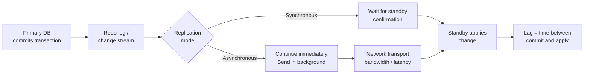

**Type:** Learn  
**Tools:** rpo-probe  
**Prerequisites:** Chapter 00, Lesson 01  
**Time:** ~50 min  
**Chapter:** 00 — DR Fundamentals

# Replication lag — what it is, why it drifts

## Motto

*Lag is not a number. It's a behaviour — and behaviour changes under load.*

## The Problem

Teams treat replication lag as a single stable number. The monitoring dashboard shows "12 minutes" and the DR owner relaxes — that's well inside the 4-hour RPO.

What they don't see:

At 2am during the nightly batch, lag spikes to 3 hours 40 minutes. It recovers to 18 minutes by 6am. By the time the DR owner checks at 9am, it's 12 minutes again. The dashboard shows green. The RPO was breached for 5 hours overnight, and nobody knows.

This is the lag drift problem. Replication lag is not a static measurement — it responds to transaction load, network congestion, maintenance windows, and dozens of other variables. A point-in-time reading tells you almost nothing about your actual DR posture.

## The Concept

**Replication lag** is the delay between when a transaction commits on the primary and when it's available on the DR replica. It's expressed as time: "the standby is 15 minutes behind primary."

### What causes lag



**Transport lag** — delay in getting redo/change data from primary to standby. Caused by: network bandwidth, latency, congestion.

**Apply lag** — delay in applying data after it arrives. Caused by: standby CPU/IO contention, large transactions that can't be parallelised, maintenance operations.

**Total lag** = transport lag + apply lag. What your monitoring shows is usually total lag.

### Why lag drifts

| Cause | When it happens | Effect on lag |
|-------|---------------|--------------|
| Peak transaction load | Business hours, batch windows | Transport lag increases — more data to replicate |
| Network congestion | Varies, often overnight (backups) | Transport lag spikes |
| Standby under maintenance | Patching, backup jobs | Apply lag increases |
| Large transactions (DDL) | Schema changes, bulk loads | Apply lag spikes — single transaction holds apply queue |
| Cascade replication | Standby feeding another standby | Compound lag |
| Redo log switch | Oracle-specific | Brief transport pause |

### Lag at worst case, not average

Your RPO target must be validated against **worst-case lag**, not average lag. If average lag is 15 minutes but peak lag is 4 hours 20 minutes, and your RPO is 4 hours — you have a compliance problem that is invisible during normal monitoring.

This is why point-in-time lag checks fail. You need:
1. Continuous lag monitoring
2. Lag history (time series, not single values)
3. Alert on breach, not on average

> **Real-world check:** Open your replication monitoring tool (vCenter, Oracle Cloud Control, AWS DRS console, Zerto Analytics). Look at the lag trend for the last 7 days, not just the current value. When does lag peak? What's the highest point? How does that compare to your declared RPO?

## Build It

**Manual lag trend analysis**

Step 1: Identify where lag data is stored for your primary replication technology.

For Oracle Data Guard:
```sql
-- Current lag
SELECT NAME, VALUE, TIME_COMPUTED
FROM V$DATAGUARD_STATS
WHERE NAME IN ('transport lag', 'apply lag');

-- Historical (if using Oracle EM or custom logging)
-- Check alert log for lag events:
-- grep "GAP" $ORACLE_BASE/diag/rdbms/*/alert_*.log
```

For VMware SRM / vSphere Replication:
```
vCenter → Monitor → vSphere Replication
Click on a protected VM → Recovery Point column
The UI shows current lag only — for history, check vRealize Operations or logs
```

For AWS DRS:
```bash
aws drs describe-source-servers \
  --filters '{"stagingAreaSubnetId":["subnet-xxxx"]}' \
  --query 'items[].{ID:sourceServerID,Lag:dataReplicationInfo.dataReplicationInitiation.steps}'
```

Step 2: Sample lag at 4 different times over 24 hours:
- 9am (business hours)
- 2pm (peak)
- 7pm (end of day, possible batch start)
- 2am (batch processing window)

Step 3: Record in the lag monitoring checklist (see artifact).

Step 4: Calculate: what is the maximum lag observed? Does it breach your declared RPO at any point?

> **Perspective shift:** You just built the manual version of what `rpo-probe` does continuously. The difference: `rpo-probe` samples lag on a configured interval, stores history, and alerts on breach. Your manual process checked 4 points. `rpo-probe` checks every N minutes and maintains a time series. For systems with unpredictable lag spikes, continuous monitoring is the only way to catch what a point-in-time check misses.

## Use It

**`rpo-probe` with continuous monitoring**

Configure `rpo-probe` to sample at a short interval and retain history:

```yaml
# rpo-probe.yaml
workloads:
  - name: erp-production
    type: oracle-dataguard
    connection: oracle-standby-host:1521/ERPDR
    declared_rpo: 240m
    sample_interval: 5m    # sample every 5 minutes
    history_retention: 30d # keep 30 days of data

  - name: crm-system
    type: aws-drs
    region: us-east-1
    source_server_id: s-xxxxxxxxxx
    declared_rpo: 60m
    sample_interval: 5m
```

```bash
# View lag trend for last 24 hours
rpo-probe history --workload erp-production --since 24h

# Find the worst-case lag in a period
rpo-probe history --workload erp-production --since 7d --stat max

# List all breach events in last 30 days
rpo-probe breaches --since 30d
```

The breach history is the evidence artifact your compliance team needs. It proves you were monitoring continuously and shows when — if ever — your RPO was exceeded.

## Ship It

**Artifact: Lag Monitoring Checklist** — see `outputs/lag-monitoring-checklist.md`

Use this to establish your baseline lag profile before writing or updating RPO targets. A target is only defensible if you have empirical lag data that confirms it's achievable.

## Evaluate It

1. What is the maximum replication lag for your most critical system in the last 7 days?
2. At what time of day does lag typically peak, and why?
3. What is the difference between transport lag and apply lag? Which one is harder to control?
4. Configure `rpo-probe` to monitor one workload at 5-minute intervals. Run for 24 hours. What's the worst-case lag?
5. If your RPO is 4 hours and worst-case lag is 3 hours 50 minutes — are you comfortable? Why or why not?

**Audit signal:** Auditors increasingly ask for "continuous RPO evidence" rather than point-in-time screenshots. A 30-day lag time series from `rpo-probe` with zero breach events is stronger audit evidence than a single screenshot from the monitoring console taken the day before the audit.
