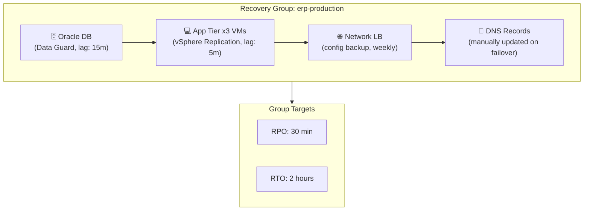

**Type:** Learn  
**Tools:** dr-discover  
**Prerequisites:** Chapter 00, Lessons 01 and 02  
**Time:** ~40 min  
**Chapter:** 00 — DR Fundamentals

# Recovery Groups — grouping workloads that fail together

## Motto

*A workload is not a system. A recovery group is.*

## The Problem

Consider a typical enterprise application stack:

- An Oracle database (replication: Data Guard)
- A Java application tier (3 VMs, replication: vSphere Replication)
- An NGINX load balancer (config backed up weekly)
- A Redis cache (no replication — in-memory, assumed ephemeral)
- An S3 bucket for documents (cross-region replication enabled)

Each of these is protected differently, monitored by different tools, owned by different teams. The database team knows their DG lag is 15 minutes. The VM team knows their vSphere replication is current. Nobody has sat down and asked: *if we fail over right now, will the application actually work?*

The database might be at T-15m. The VMs at T-5m. The Redis cache at T=0 (empty — no replication). The application will start, connect to the database, and immediately fail because the session state in Redis doesn't exist.

Protecting components in isolation doesn't protect the application. Recovery requires understanding how components relate to each other, and which ones must fail over together in what order to produce a working system. That structure is a **Recovery Group**.

## The Concept

A **Recovery Group** (also called a "protection group" in some vendor documentation) is a named collection of components that collectively represent a workload, share a common RPO/RTO target, and must be recovered together to produce a functioning system.

The Recovery Group is the atomic unit of DR. You don't recover a database. You recover the ERP system: the database, the app tier, the network configuration, and the DNS records that point traffic to it.



**What a Recovery Group captures:**

| Element | What it is | Example |
|---------|-----------|---------|
| Components | The systems that make up the workload | Oracle DB, 3 App VMs, Load Balancer |
| Replication map | How each component is replicated | DG (DB), vSphere (VMs), manual (LB config) |
| Dependency order | Which comes up first on recovery | DB → App → LB → DNS |
| RPO target | Maximum acceptable data loss for the group | 30 minutes |
| RTO target | Maximum acceptable downtime for the group | 2 hours |
| Owner | Who declares a failover and approves recovery | CISO + Application Owner |

### The dependency order is everything

The RPO/RTO target applies to the *group*, not individual components. If the database has a 15-minute lag and the app tier has a 5-minute lag, the group's effective RPO is 15 minutes. The slowest component sets the ceiling.

The RTO is constrained by:
1. Time to recover all components
2. Time to validate each component is healthy before starting the next
3. The dependency chain: you cannot start the app tier before the database is up

A Recovery Group makes this dependency chain explicit and ensures it's respected during a real failover.

### Recovery Groups vs vendor protection groups

Many replication vendors have their own concept of "protection group" (VMware SRM, Zerto, ASR):

| Vendor concept | Scope | Limitation |
|---------------|-------|-----------|
| VMware SRM Protection Group | VMs only | Doesn't include databases, K8s, object storage |
| Zerto VPG | VMs + storage | Single replication technology |
| Azure ASR Replication Group | VMs in Azure | Azure-native only |

A Recovery Group is **workload-scoped and technology-agnostic**. It spans whatever components make up the application: multiple replication technologies, multiple clouds, multiple tiers. This is the core idea that the industry is gradually converging on, and it's the abstraction that DR orchestration platforms use to manage failover at application level rather than component level.

> **Real-world check:** Pick one business-critical application in your environment. List every component that must be running and consistent for that application to work. Now count how many different replication technologies are protecting those components. That count is your "DR complexity score." If it's more than 2, you need Recovery Groups.

## Build It

**Manual Recovery Group mapping — no tools required**

Step 1: Choose one application (pick your most critical one).

Step 2: List every component:
```
Application: _______________

Components:
  [ ] Database
      Type: _____, Replication: _____, Current lag: _____
  [ ] Application server(s)
      Count: _____, Replication: _____, Current lag: _____
  [ ] Cache / in-memory store
      Type: _____, Replication: _____, Notes: _____
  [ ] File/object storage
      Type: _____, Replication: _____, Current lag: _____
  [ ] Load balancer / reverse proxy
      Type: _____, Config backup: _____, Frequency: _____
  [ ] DNS / traffic routing
      Type: _____, Failover method: _____
  [ ] Secrets / certificates
      Type: _____, Failover method: _____
  [ ] Other: _____
```

Step 3: Map dependencies:
```
Startup order on recovery:
  1. _______________ (must be healthy before step 2)
  2. _______________
  3. _______________
  4. _______________
```

Step 4: Determine the group-level RPO:
```
Component with highest lag: _______________
Group RPO (= slowest component): _______________
Declared RPO target: _______________
Gap: _______________
```

Step 5: Fill in the Recovery Group Mapping Template (see artifact).

> **Perspective shift:** You just did manually what `dr-discover` scans for automatically. `dr-discover` queries your cloud accounts and replication tools to enumerate components, map dependencies, and surface components with no DR coverage. The manual process takes hours per application. `dr-discover` does it in minutes across your entire estate.

## Use It

**`dr-discover`** scans your cloud accounts and replication configuration to enumerate your workloads and surface them as candidate Recovery Groups.

```bash
# Install
brew install kontinuity-io/tap/dr-discover

# Configure cloud credentials (reads from standard credential chain)
dr-discover init

# Scan and discover workloads
dr-discover scan --output discovery.json

# View candidate Recovery Groups
dr-discover groups

# Example output:
# Candidate Recovery Group: erp-production
#   Components: 4 (oracle-db, app-vm-1, app-vm-2, load-balancer)
#   Replication coverage: 3/4 components
#   ⚠ No replication detected: load-balancer (config-only, no DR)
#   Effective RPO: unknown (no lag metrics found)
#   Suggested RTO: 2–4h (based on component count and dependencies)
```

The `dr-discover` output gives you a starting point for your Recovery Group mapping. Components flagged as "no replication detected" are immediate risks.

## Ship It

**Artifact: Recovery Group Mapping Template** — see `outputs/recovery-group-template.md`

One template per Recovery Group. Complete one for each Tier-1 and Tier-2 application. This document becomes the source of truth for failover execution and compliance evidence.

## Evaluate It

1. For one application, list all components and their replication technology. Which component has the highest lag?
2. What is the Recovery Group's effective RPO if component A has 5-minute lag, B has 45-minute lag, and C has no replication?
3. What's the difference between a VMware SRM protection group and a Recovery Group?
4. Run `dr-discover scan` against your environment. How many candidate Recovery Groups are identified? How many have components with no replication coverage?
5. Write a recovery dependency order for one of your applications. What breaks if you start the app tier before the database is healthy?

**Audit signal:** Auditors under SAMA, NCA, and ISO 22301 increasingly ask for a "system dependency map" alongside DR evidence. A completed Recovery Group mapping template is exactly this document. Chapter 6 shows how to package Recovery Group data into a compliance evidence artifact.
