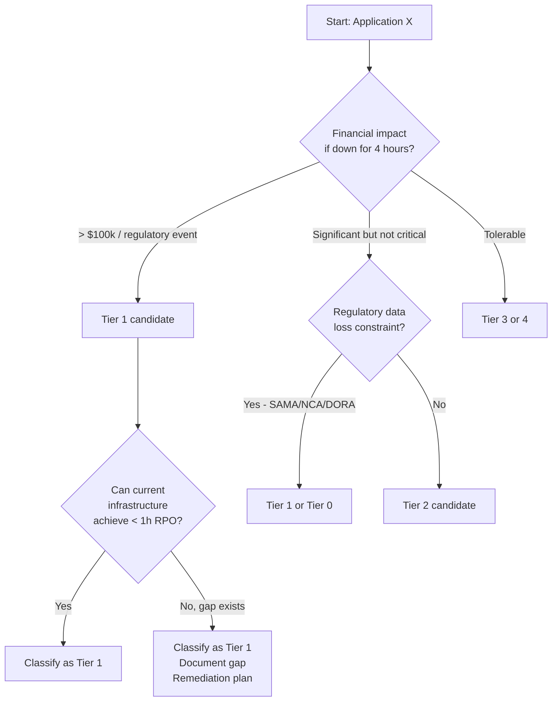

**Type:** Learn  
**Tools:** dr-posture  
**Prerequisites:** Chapter 00, Lesson 03  
**Time:** ~45 min  
**Chapter:** 00 — DR Fundamentals

# Tier classification — who needs what SLA

## Motto

*Not everything deserves a 4-hour RPO. Treating everything as Tier 1 makes nothing Tier 1.*

## The Problem

Applying the same DR target to all systems is common, because tiering feels like a political minefield. Every application owner believes their system is critical. The result: an impossibly expensive DR programme that tries to protect everything identically and therefore protects nothing well.

Or the opposite: no tiering at all. Everything gets "best effort," which in practice means "whatever happens, happens."

Tier classification is the discipline of deciding, explicitly and in advance, which systems get which level of DR protection and why.

## The Concept

A **DR tier** is a named level of protection defined by RPO, RTO, and the business impact of a prolonged outage.

### Standard tier model

| Tier | Name | RPO | RTO | Business impact if down |
|------|------|-----|-----|------------------------|
| Tier 0 | Zero data loss | Seconds | Minutes | Regulatory — data loss not permitted |
| Tier 1 | Mission Critical | < 1 hour | < 2 hours | Direct revenue loss or regulatory penalty |
| Tier 2 | Business Critical | < 4 hours | < 8 hours | Significant operational disruption |
| Tier 3 | Standard | 24 hours | 48 hours | Inconvenient but tolerable |
| Tier 4 | Non-critical | Best effort | Best effort | Internal tools, dev environments |

### How to classify

Classification is a business conversation, not a technical one. The technical team provides options and costs. The business decides what it can tolerate.



### The compliance dimension

For GCC banks under SAMA/NCA, tier classification is a regulatory requirement:

- **SAMA BCM**: requires classification of "critical business functions" and associated IT systems
- **NCA ECC-2**: requires categorisation by "criticality level" with corresponding DR targets
- **ISO 22301**: requires prioritisation of activities with "maximum tolerable period of disruption"
- **DORA** (EU): requires "critical or important functions" mapping

Your tier classification document is a direct input to your regulatory compliance evidence.

> **Real-world check:** Count how many systems are currently classified as "Tier 1" or "Mission Critical." If the answer is more than 20% of your estate, the classification is probably not real. You've given Tier 1 status to everything, which means you can't deliver Tier 1 SLAs for anything.

## Build It

**Manual tier classification workshop**

Run this as a structured conversation with application owners and the business. Do not let application owners self-classify. The conversation must include someone who understands the business cost of downtime.

For each application, answer:

```
Application: _______________

1. What breaks downstream if this is down for 2 hours?
   _______________

2. What is the direct financial impact per hour of downtime?
   _______________

3. Is there a regulatory requirement for data loss limit?
   ☐ Yes (specify regulation): _______________
   ☐ No

4. Can users work around this outage manually?
   ☐ No — hard stop to business
   ☐ Partially — degraded operations only
   ☐ Yes — manual workaround exists

5. What tier do these answers suggest?
   _______________

6. Can current infrastructure deliver that tier's RPO/RTO?
   ☐ Yes
   ☐ No — gap: _______________
```

> **Perspective shift:** `dr-posture` scans your environment, surfaces all applications with no DR coverage, and groups them by estimated criticality (resource size, compliance tags, network topology). The business decision is yours. `dr-posture` makes sure you're not making that decision while blind to what's actually in your estate.

## Use It

```bash
# Scan DR posture across your estate
dr-posture scan --output posture.json

# Show all Tier 1 systems with no DR configured
dr-posture report --filter "tier=1 AND dr=none"

# Show all systems with no tier classification
dr-posture report --filter "tier=unclassified"
```

## Ship It

**Artifact: Tier Classification Matrix** — see `outputs/tier-classification-matrix.md`

The tier classification matrix is a living document. Every new system must be classified before it goes to production. Review annually or when business functions change significantly.

## Evaluate It

1. Why is "everything is Tier 1" a failure mode, not a safe default?
2. What regulatory requirements in your jurisdiction drive tier classification?
3. How many Tier 1 systems can your current infrastructure actually support with sub-1-hour RPO?
4. Run `dr-posture scan`. How many systems have no tier classification?
5. For three applications, complete the classification worksheet. Do the results match current DR configuration?
