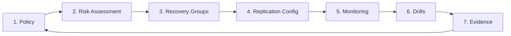

**Type:** Learn  
**Tools:** None  
**Prerequisites:** Chapter 00, Lessons 01–04  
**Time:** ~50 min  
**Chapter:** 00 — DR Fundamentals

# DR programme anatomy — components, ownership, evidence

## Motto

*A DR programme is not a backup job. It's a continuous organisational capability.*

## The Problem

There's a difference between "having DR" and "having a DR programme." An auditor, a regulator, or an actual disaster will make that difference very clear.

"Having DR" means: there is replication configured somewhere for some systems. Maybe a backup job that runs nightly. Maybe vSphere Replication turned on for a few VMs. Maybe AWS DRS configured for the production account.

"Having a DR programme" means: there is a documented, tested, owned, continuously monitored set of policies and procedures that ensures your organisation can recover critical systems within defined targets. And can *prove* it.

Governance, ownership, and evidence are what separate the two. This lesson maps the full anatomy of a DR programme.

## The Concept

A DR programme has seven components. All seven must be present for the programme to be credible:



| Component | What it is | Without it... |
|-----------|-----------|--------------|
| **Policy** | Documented RPO/RTO targets, tier classification, ownership | No one knows what the goals are |
| **Risk Assessment** | Threat model, BIA, gap analysis | Protection based on assumptions, not reality |
| **Recovery Groups** | Workload-level dependency maps | Component-level recovery that doesn't produce working applications |
| **Replication Config** | Actual replication configured per component | No DR capability |
| **Monitoring** | Continuous lag measurement, alert on breach | RPO breaches invisible until disaster |
| **Drills** | Regular tested failovers with recorded RTA | RTO is declared, not demonstrated |
| **Evidence** | Timestamped records of all the above | Audit fails, compliance fails |

### Ownership

A DR programme requires three distinct roles:

**DR Owner** — accountable for the programme. Typically CISO, BCM Manager, or CTO. Signs off on policy, approves drill results, receives compliance reports.

**Technical DR Lead** — responsible for implementation. Configures replication, runs drills, manages monitoring. Typically a senior SRE or infrastructure architect.

**Application Owners** — responsible for their Recovery Groups. Validates recovery of their application post-failover. Approves the Recovery Group mapping.

Without clear ownership, the programme degrades. Replication goes unmonitored. Drills get cancelled. Evidence doesn't get collected.

### The evidence chain

SAMA, NCA, DORA, and ISO 22301 all require evidence of DR capability, not just documentation that DR exists. The evidence chain is:

```
Policy (what you declared) 
  → Recovery Group maps (what you're protecting) 
    → Replication config (how you're protecting it) 
      → Lag monitoring history (ongoing RPO evidence) 
        → Drill records (demonstrated RTO evidence) 
          → Compliance mapping (regulation → control → evidence)
```

A gap at any step in this chain produces a compliance finding.

> **Real-world check:** Walk through the evidence chain for your most critical system. Can you produce each item right now? Where does the chain break? The most common breakpoints: (1) no continuous lag history, (2) last drill was > 12 months ago, (3) drill evidence not linked to Recovery Groups in compliance documentation.

## Build It

**DR programme gap analysis — manual**

Rate each component as Green (present and maintained), Amber (present but gaps), or Red (missing):

```
Component             Status    Notes
─────────────────────────────────────────────────
Policy                ☐ G ☐ A ☐ R
  - RPO/RTO targets documented?
  - Tier classification complete?
  - Review schedule set?

Risk Assessment       ☐ G ☐ A ☐ R
  - Threat model current (< 12 months)?
  - BIA completed?
  - Gap analysis documented?

Recovery Groups       ☐ G ☐ A ☐ R
  - All Tier 1/2 apps mapped?
  - Dependency orders documented?
  - Coverage gaps identified?

Replication Config    ☐ G ☐ A ☐ R
  - All Tier 1/2 components replicated?
  - Configuration documented?
  - Change management process?

Monitoring            ☐ G ☐ A ☐ R
  - Continuous lag monitoring?
  - Alert thresholds set?
  - Alert responses documented?

Drills                ☐ G ☐ A ☐ R
  - Scheduled drill calendar?
  - Last drill < 12 months ago?
  - RTA recorded vs RTO?

Evidence              ☐ G ☐ A ☐ R
  - Evidence stored centrally?
  - Compliance mapping current?
  - Audit-ready format?
```

> **Perspective shift:** This manual gap analysis tells you what's missing. Kontinuity's platform (v0.1 onward) makes several of these components automated: Recovery Group monitoring, continuous lag measurement, drill recording, and evidence generation. But you need to understand the anatomy before you can evaluate what to automate.

## Use It

No specific CLI tool for this lesson — this is organisational work. The tools introduced in earlier lessons (`rpo-probe`, `dr-discover`, `dr-posture`) each address specific components:

| Tool | Programme component it addresses |
|------|----------------------------------|
| `rpo-probe` | Monitoring: continuous lag measurement |
| `dr-discover` | Recovery Groups: workload discovery |
| `dr-posture` | Risk Assessment: gap analysis |
| `dr-drift` | Monitoring: config drift between primary and DR |

Chapter 8 maps all Kontinuity OSS tools to programme components.

## Ship It

**Artifact: Programme Anatomy Diagram** — see `outputs/programme-anatomy.md`

A one-page reference document mapping your DR programme components, owners, and current status. Use this as a standing agenda for your DR programme review meetings.

## Evaluate It

1. For each of the seven DR programme components — which does your organisation have, and which are gaps?
2. Who owns your DR programme? If the answer is "everyone," it's no one.
3. What evidence does your organisation currently have that could be presented to an auditor? Walk through the evidence chain for one Tier-1 system.
4. What is a BIA (Business Impact Analysis) and how does it feed into tier classification?
5. Design a quarterly DR programme review meeting agenda using the seven components as the framework.
