**Category:** Topology
**Workload:** Any
**Topology:** Active/Passive
**Typical RPO:** 15 min – 4 hours
**Typical RTO:** 1–4 hours
**Complexity:** Low

# Active/Passive — Single Vendor

The foundational DR topology. One primary site runs all production workloads. One DR site receives replicated data through a single replication technology. The DR site is passive: no production traffic, lower compute (or powered off). On failover, traffic redirects to DR and the primary goes dark.

This is the starting point for most DR programmes. Choose this before considering more complex topologies.

## Diagram

```mermaid
flowchart LR
    subgraph PROD["Primary Site"]
        LB_P["Load Balancer"]
        APP_P["Application\nTier"]
        DB_P[("Database")]
        STORE_P["Object Storage\n/ Files"]
    end

    subgraph REPL["Replication Layer"]
        direction TB
        R1["DB replication\n(e.g. DG, streaming)"]
        R2["Storage replication\n(e.g. SRM, S3 CRR)"]
    end

    subgraph DR["DR Site (Passive)"]
        LB_D["Load Balancer\n(pre-configured)"]
        APP_D["Application\nTier (idle)"]
        DB_D[("Database\n(standby)")]
        STORE_D["Object Storage\n(replica)"]
    end

    subgraph DNS["Traffic Control"]
        DNS_CTL["DNS / GTM\n(points to primary)"]
    end

    USERS(["Users"])
    USERS --> DNS_CTL --> LB_P

    LB_P --> APP_P --> DB_P
    DB_P -->|"DB replication"| R1 --> DB_D
    STORE_P -->|"Storage replication"| R2 --> STORE_D

    DB_D --> APP_D --> LB_D
    DNS_CTL -.->|"On failover:\nupdate DNS"| LB_D

    style PROD fill:#111,stroke:#333
    style DR fill:#111,stroke:#444
    style REPL fill:none,stroke:#555,stroke-dasharray:4
```

## When to use this topology

Use active/passive single-vendor when:
- Your workloads live primarily on one technology stack (Oracle, VMware, AWS)
- You have a clear primary site with a physically or logically separate DR site
- RTO > 30 minutes is acceptable (recovery involves human steps)
- Budget constrains keeping a fully-powered DR site

Do not use when:
- Regulatory requirements mandate provider independence (DORA, some SAMA scenarios)
- RTO < 15 minutes requires hot standby with automatic failover
- Workloads span multiple clouds with no single replication technology covering all of them

## Key Decisions

**Hot vs warm vs cold DR site.** Hot: DR site runs identical infrastructure, instant failover. Warm: DR site runs reduced infrastructure (pilot light), minutes to hours to scale up. Cold: no running infrastructure, hours to days to build. Cost decreases left to right; RTO increases.

**Single vs multiple Recovery Groups.** Even in a simple two-site topology, different workloads may have different RPO/RTO targets. Group them accordingly. The topology is simple; the Recovery Group structure can still be nuanced.

**Failover trigger.** Who declares the failover? Under what conditions? Is there an automated trigger or is it always manual? Define this before you need it.

**Failback plan.** After failover, you have a "DR site" running production. Getting back to the original primary requires a reverse replication setup and a planned switchover. Plan failback as part of the initial DR design, not afterwards.

## Gotchas

- **Network and DNS are the last mile.** Most failover procedures complete technically but fail at traffic redirection. TTL on DNS records must be lowered ahead of a failover — high TTLs (1 hour+) mean users see the wrong site long after the DB and app are up at DR.
- **"Passive" doesn't mean untouched.** DR site infrastructure drifts from production over time — different OS patch levels, different config, different software versions. Use `dr-drift` to detect and alert on config drift between sites.
- **Firewall rules.** Production firewall rules are rarely mirrored to DR exactly. Test application connectivity (not just server reachability) during drills.
- **Replication technology covers compute + DB, but what about everything else?** DNS zones, TLS certificates, API keys, secrets — often not covered by the primary replication tool. Inventory all components and verify each has a DR path.

## Related

- [Pattern: Oracle DG Active/Passive](/patterns/oracle-dataguard-active-passive)
- [Pattern: VMware SRM Pilot Light](/patterns/vmware-srm-pilot-light)
- [Pattern: AWS DRS Cross-Region](/patterns/aws-drs-cross-region)
- [Pattern: Multi-Cloud Active/Passive](/patterns/multi-cloud-active-passive)
- [Chapter 01 — Designing a DR Programme](/chapter/01)
