**Category:** Workload
**Workload:** Physical / VMs / Cloud workloads
**Replication:** AWS DRS replication agent
**Topology:** Active/Passive
**Typical RPO:** < 15 min
**Typical RTO:** < 1 hour
**Complexity:** Low
**Cloud:** AWS

# AWS DRS — Cross-Region

AWS Elastic Disaster Recovery (DRS) replicates block storage from source servers to a staging area in the target AWS region. The source can be on-premises servers, VMware VMs, other cloud providers, or another AWS region. DRS installs a lightweight agent on the source. On failover, DRS launches recovery EC2 instances from the latest replicated snapshot.

The staging area keeps a continuous rolling copy of source block storage — you select which point in time to launch from. No manual snapshot scheduling required.

## Diagram

```mermaid
flowchart LR
    subgraph SOURCE["Source (on-prem / other cloud / AWS region)"]
        SERVER1["Server / VM 1"]
        SERVER2["Server / VM 2"]
        AGENT["DRS Replication\nAgent (each server)"]
    end

    subgraph STAGING["AWS Target Region — Staging Area"]
        REPL["Replication\nServer"]
        EBS_STAGING["EBS Volumes\n(continuous copy)"]
    end

    subgraph RECOVERY["AWS Target Region — On Declare"]
        EC2_1["Recovery EC2\nInstance 1"]
        EC2_2["Recovery EC2\nInstance 2"]
        EBS_LIVE["EBS Volumes\n(from staging)"]
        ELB["Load Balancer\n(pre-configured)"]
    end

    SERVER1 & SERVER2 --> AGENT
    AGENT -->|"Encrypted\nblock replication"| REPL
    REPL --> EBS_STAGING
    EBS_STAGING -->|"Launch from\nselected point"| EBS_LIVE
    EBS_LIVE --> EC2_1 & EC2_2
    EC2_1 & EC2_2 --> ELB

    style SOURCE fill:#111,stroke:#333
    style STAGING fill:#111,stroke:#444
    style RECOVERY fill:#111,stroke:#2a6
```

## Components

| Component | Role | Notes |
|-----------|------|-------|
| DRS Agent | Installed on each source server | Linux and Windows; lightweight, replicates block changes |
| Replication server | Receives and writes block changes | Managed by AWS; runs in target VPC |
| Staging EBS volumes | Rolling copy of source disks | Not launched VMs — raw storage only |
| Launch settings | EC2 instance type, VPC, subnet, IAM | Configured per source server before failover |
| Recovery instances | Launched on declare | Use latest or a specific point-in-time snapshot |
| Recovery plan | Ordered launch sequence | AWS DRS launch plans define dependency order |

## Key Decisions

**Instance type mapping.** Source servers map to target EC2 instance types. Oversizing is safe; undersizing causes performance problems post-failover. Define launch settings before you need them.

**VPC and network pre-configuration.** Recovery EC2 instances launch into a pre-configured VPC. Subnets, security groups, and routing must exist before failover. Don't design the DR network during a DR event.

**Point-in-time selection.** DRS keeps a rolling window of recovery points. The default launch uses the latest. For ransomware recovery, select an earlier clean point — but the further back you go, the more data you lose.

**Agent footprint.** The DRS agent uses < 5% CPU and < 10MB/s bandwidth during steady-state replication. Spikes during initial sync (full disk copy). Schedule initial sync during low-traffic windows for large servers.

**Cross-region vs cross-account.** DRS supports both. Cross-account isolation (DR AWS account separate from production) prevents account compromise scenarios from affecting DR.

## Gotchas

- **Initial sync time.** For a 10TB server, initial sync can take 24–48 hours over typical WAN. Plan for this in Day 1 deployment.
- **Windows boot issues post-failover.** AWS injects drivers during launch. Some Windows versions require additional driver injection for EC2 compatibility. Test failover in drills — don't discover boot failures during a real incident.
- **Application-level consistency.** DRS is block-level — it doesn't quiesce databases before snapshots. For transactionally consistent recovery, either use application-aware snapshots (VSS on Windows, freeze/thaw scripts on Linux) or accept crash-consistent recovery and a DB recovery run post-failover.
- **Agent must remain running.** If the source server reboots and the agent doesn't restart automatically, replication pauses and lag accumulates silently. Monitor agent status via DRS API or CloudWatch.
- **Staging area costs.** The staging area accrues EBS storage costs 24/7. Size the staging volumes based on source disk size, not data size. A 2TB disk with 200GB of data still needs a 2TB staging volume.

## RPO/RTO Profile

**RPO** during steady-state: 5–15 minutes (block change capture interval). Large write bursts can cause temporary lag spikes.

**RTO** breakdown:
1. Launch recovery instances: 5–10 min (EC2 startup)
2. OS boot and service startup: 3–10 min
3. Application health check: 5–15 min
4. DNS or load balancer update: 5–10 min

Total: 20–45 minutes for typical workloads.

## Related

- [Chapter 02, Lesson 03 — AWS DRS](/chapter/02/03)
- [Chapter 00, Lesson 03 — Recovery Groups](/chapter/00/03)
- [Pattern: Multi-Cloud Active/Passive](/patterns/multi-cloud-active-passive)
- [Pattern: Active/Passive Single Vendor](/patterns/active-passive-single-vendor)
