**Category:** Vertical
**Workload:** Financial services platform
**Replication:** AWS DRS + Azure Site Recovery
**Topology:** Multi-cloud Active/Passive
**Typical RPO:** < 30 min
**Typical RTO:** < 2 hours
**Complexity:** High
**Cloud:** AWS primary, Azure DR
**Compliance:** DORA Art. 11

# EU Fintech — Multi-Cloud (DORA)

DORA Article 11 requires EU financial entities to ensure ICT service continuity even if a single cloud provider is unavailable. This pattern places production on AWS and DR on Azure. AWS DRS replicates primary compute workloads; Azure Site Recovery (ASR) protects Azure-native workloads. A cross-provider network path (private peering or VPN) carries replication traffic. Failover activates Azure resources and redirects traffic.

This pattern satisfies the DORA requirement for "alternative technical infrastructure" and provider independence. It is operationally complex — test recovery thoroughly and frequently.

## Diagram

```mermaid
flowchart LR
    subgraph AWS["AWS — Production (eu-west-1)"]
        EC2["EC2 Application\nServers"]
        RDS["RDS PostgreSQL"]
        S3_AWS["S3 Data"]
        DRS_A["DRS Agent\n(on EC2)"]
    end

    subgraph NETWORK["Cross-Cloud Network"]
        VPN["AWS Direct Connect\n+ Azure ExpressRoute\n(or site-to-site VPN)"]
    end

    subgraph AZURE["Azure — DR (westeurope)"]
        ASR_VAULT["ASR Recovery\nServices Vault"]
        AZURE_VMS["Azure VMs\n(powered off / ASR cache)"]
        AZURE_DB["Azure DB for PostgreSQL\n(read replica / restore)"]
        BLOB["Azure Blob Storage\n(S3 replicated data)"]
    end

    subgraph EVIDENCE["DORA Evidence"]
        ICT_POLICY["ICT Continuity\nPolicy (Art. 11.1)"]
        TEST_RECORD["Annual cross-cloud\nfailover test record"]
        RTO_REC["RTO/RPO\nAchievement Records"]
    end

    EC2 & RDS --> DRS_A
    DRS_A -->|"Encrypted\nreplication"| VPN
    VPN --> ASR_VAULT
    ASR_VAULT --> AZURE_VMS
    RDS -->|"Logical replication\nor restore from backup"| AZURE_DB
    S3_AWS -->|"S3-to-Blob\nreplication"| BLOB

    ICT_POLICY & TEST_RECORD & RTO_REC --> DORA_REPORT["DORA Art. 11\nCompliance"]

    style AWS fill:#111,stroke:#333
    style AZURE fill:#111,stroke:#2a6
    style NETWORK fill:none,stroke:#555,stroke-dasharray:4
    style EVIDENCE fill:#111,stroke:#f59e0b,stroke-dasharray:4
```

## DORA Requirements Mapping

| Requirement | DORA Reference | How this pattern satisfies it |
|-------------|---------------|-------------------------------|
| ICT continuity policy | Art. 11.1 | DR policy with targets; reviewed annually |
| Alternative infrastructure | Art. 11.2 | Separate cloud provider (Azure) as DR |
| Annual testing | Art. 11.6 | Full failover drill to Azure; RTA recorded |
| Lessons learned | Art. 11.7 | Post-drill report with findings and remediation |
| TLPT (for significant firms) | Art. 26 | Threat-led penetration test includes DR scenario |
| ICT third-party risk | Art. 28 | Both AWS and Azure registered as critical ICT third parties |

## Components

| Component | AWS (Primary) | Azure (DR) | Gap / Notes |
|-----------|-------------|-----------|-------------|
| Compute | EC2 | Azure VMs (via ASR) | Instance type mapping needed |
| Database | RDS PostgreSQL | Azure DB for PostgreSQL | Logical replication or restore from backup |
| Object storage | S3 | Azure Blob | Rclone / AWS DataSync / custom sync |
| Secrets | AWS Secrets Manager | Azure Key Vault | Manual sync or HashiCorp Vault spanning both |
| IAM / Identity | AWS IAM | Azure AD | Separate identity planes — no native federation |
| Network | VPC | VNet | Pre-configured VPN or Direct Connect + ExpressRoute |

## Key Decisions

**Database replication across clouds.** RDS does not natively replicate to Azure. Options: (1) logical replication from RDS to Azure DB for PostgreSQL (low RPO, complex setup), (2) continuous backup to S3 + restore to Azure (higher RPO, simpler), (3) application-level dual-write (very complex, not recommended). Most fintechs choose option 2 with automated restore validation.

**Identity federation.** AWS IAM and Azure AD are separate systems. DR workloads running in Azure must use Azure AD. Application identities referencing AWS IAM roles will break. Plan identity mapping before failover.

**Cross-cloud latency.** DRS replication over a public internet path adds latency and unpredictability. Use AWS Direct Connect to Azure ExpressRoute via a co-location facility for consistent, sub-50ms replication paths. Budget ~$1,500–3,000/month for dedicated cross-cloud connectivity.

**DNS and traffic routing.** Route 53 and Azure Traffic Manager both support health-check-based failover. Use a global DNS service (Route 53 or Cloudflare) as the single control plane for traffic routing during failover.

**DORA testing obligation.** DORA Article 11.6 requires annual ICT continuity tests. For significant firms (AuM > €30B or systemic importance), TLPT (TIBER-EU) threat-led tests are required every 3 years and must include DR scenarios.

## Gotchas

- **S3-to-Blob sync is not native.** AWS and Azure do not have a managed cross-cloud replication service. Use Rclone, AWS DataSync (S3→SFTP→Blob), or a purpose-built sync job. Monitor sync lag independently.
- **ASR requires Azure agent.** ASR agent installation on workloads replicating from AWS is straightforward for VMs but adds complexity for container workloads. Consider AWS DRS for compute and a separate approach for containers.
- **Different availability zone models.** AWS AZs and Azure zones have different failure domain semantics. Your DR topology in Azure should match your production resilience posture, not just your DR requirements.
- **Certificate and TLS differences.** Certificate management differs between ACM (AWS) and Azure Key Vault / App Gateway. Certificates must be replicated or issued by a CA accessible in both clouds.
- **DORA registration.** Your ICT third-party register (required under Art. 28) must list both AWS and Azure as critical ICT providers. This is an admin obligation separate from the technical DR setup.

## Related

- [Pattern: Multi-Cloud Active/Passive](/patterns/multi-cloud-active-passive)
- [Pattern: AWS DRS Cross-Region](/patterns/aws-drs-cross-region)
- [Chapter 06 — Compliance Evidence](/chapter/06)
