**Category:** Vertical
**Workload:** Oracle Database + Core Banking + App Tier
**Replication:** Oracle Data Guard + VMware SRM
**Topology:** Active/Passive
**Typical RPO:** < 15 min
**Typical RTO:** < 2 hours
**Complexity:** High
**Cloud:** On-premises / private cloud
**Compliance:** SAMA BCM, NCA ECC-2

# GCC Bank — Oracle DB (SAMA/NCA)

Full DR pattern for a GCC bank under Saudi Arabia Monetary Authority (SAMA) Business Continuity Management (BCM) requirements and National Cybersecurity Authority (NCA) Essential Cybersecurity Controls (ECC-2). The core banking database runs Oracle Data Guard; the application tier runs on VMware protected by SRM. Both replication channels feed into a unified Recovery Group with shared RPO/RTO targets documented for SAMA Annex 2 compliance.

Data residency is a hard constraint: primary and DR sites must both be within Saudi Arabia or the same GCC country depending on classification. Cross-border failover is not permitted without SAMA/SAMA-PDPL approval.

## Diagram

```mermaid
flowchart TB
    subgraph PROD["Primary Data Centre — KSA"]
        direction LR
        CORE["Core Banking\nApplication"]
        APP_T["App Tier\n(VMware VMs)"]
        ORACLE_P[("Oracle DB\nPrimary")]
        MQ["Message Queue\n(MQ/Kafka)"]
    end

    subgraph REPLICATION["Replication Layer"]
        DG_STREAM["Oracle DG\nRedo stream"]
        SRM_REPL["vSphere\nReplication"]
    end

    subgraph DR_DC["DR Data Centre — KSA (same country)"]
        direction LR
        APP_DR["App Tier\n(powered off)"]
        ORACLE_DR[("Oracle DB\nPhysical Standby")]
        MQ_DR["Message Queue\n(idle)"]
        SRM_DR["SRM Recovery\nPlan"]
    end

    subgraph EVIDENCE["SAMA Evidence Trail"]
        RG["Recovery Group\nMapping"]
        LAG_MON["Continuous lag\nmonitoring (rpo-probe)"]
        DRILL["Quarterly drill\nrecords + RTA"]
        REPORT["SAMA Annex 2\nCompliance Report"]
    end

    CORE --> APP_T --> ORACLE_P
    ORACLE_P -->|"Async DG\n< 15 min lag"| DG_STREAM
    APP_T -->|"vSphere\nreplication"| SRM_REPL
    DG_STREAM --> ORACLE_DR
    SRM_REPL --> APP_DR
    SRM_DR --> APP_DR

    RG & LAG_MON & DRILL --> REPORT

    style PROD fill:#111,stroke:#333
    style DR_DC fill:#111,stroke:#2a6
    style REPLICATION fill:none,stroke:#555,stroke-dasharray:4
    style EVIDENCE fill:#111,stroke:#f59e0b,stroke-dasharray:4
```

## Regulatory Requirements

| Requirement | SAMA BCM Ref | NCA ECC-2 Ref | How this pattern satisfies it |
|-------------|-------------|--------------|-------------------------------|
| RPO for critical systems | BCM-1.2 | CCC-1.1 | DG async lag < 15 min; monitored continuously |
| RTO for critical systems | BCM-1.2 | CCC-1.1 | SRM Recovery Plan tested quarterly; RTA < 2h |
| DR site within jurisdiction | BCM-3.1 | — | Both sites within KSA |
| Annual DR test | BCM-4.1 | CCC-2.3 | Quarterly non-disruptive test + annual live failover |
| Evidence retention | BCM-4.2 | CCC-2.4 | Drill records, lag history, sign-off stored 5 years |
| BCM policy approved | BCM-1.1 | — | DR policy signed by CISO + Board annually |

## Components

| Component | Technology | RPO contribution |
|-----------|-----------|-----------------|
| Core Banking DB | Oracle Data Guard async | 5–15 min lag (primary constraint) |
| App Tier VMs | VMware vSphere Replication | 15–30 min lag (typically better than DB) |
| Message Queue | Manual broker config backup | Recovery: redeploy from config; messages lost |
| Evidence store | Centralised (SharePoint / Confluence) | N/A |

## Key Decisions

**Data residency enforcement.** Confirm with your legal and compliance team which data classifications require in-country storage. PDPL (Saudi Personal Data Protection Law) imposes cross-border transfer restrictions on personal data. Map each database schema to its PDPL classification before choosing DR site location.

**SAMA Annex 2 mapping.** SAMA requires a formal mapping between critical systems, their BCM targets, and evidence of testing. The Recovery Group template from Chapter 0 produces exactly this document. SAMA auditors will ask for it.

**Two-channel replication coherency.** Oracle DG and SRM operate independently. If Oracle DG falls behind but SRM is current, the DR site has newer app-tier VMs than database — a consistency problem. On failover, always bring up the DB first, validate its recovery point, then start the app tier.

**Recovery Plan scripts.** SRM scripts must include: DB validation (check standby lag, run select from key tables), app tier health check, connectivity test to payment network. Do not declare success until all scripts pass.

**Evidence generation.** `rpo-probe` monitors Oracle DG lag continuously. Drill records must capture: date/time, recovery type (test vs live), RTA achieved, and operator sign-off. Chapter 6 covers SAMA-compliant evidence packaging.

## Gotchas

- **SAMA audit timing.** SAMA BCM inspections typically occur with 2–4 weeks notice. If your last drill was 14 months ago, you have a finding before the auditor opens their laptop.
- **SRM and Oracle interaction.** When SRM powers on app-tier VMs at DR, they attempt to connect to the database. If the Oracle standby is still in managed recovery (not yet promoted), connections fail. Add a DB readiness check as a pre-step in the SRM Recovery Plan.
- **Telecom provider DR path.** GCC banks connect to SWIFT, national payment networks (SARIE, mada), and central bank systems. Confirm your DR site has equivalent connectivity — some payment network connections are data-centre-specific.
- **RPO drift during patching.** Oracle patching windows (PSU/RU cycles) temporarily suspend DG apply, which causes apply lag to accumulate. Account for this in your RPO headroom and notify compliance ahead of the window.

## Related

- [Pattern: Oracle DG Active/Passive](/patterns/oracle-dataguard-active-passive)
- [Pattern: VMware SRM Pilot Light](/patterns/vmware-srm-pilot-light)
- [Chapter 06 — Compliance Evidence](/chapter/06)
- [Chapter 00, Lesson 03 — Recovery Groups](/chapter/00/03)
