**Category:** Vertical
**Workload:** EHR / Medical Imaging
**Replication:** Velero + S3 cross-region
**Topology:** Backup/Restore
**Typical RPO:** 4–24 hours
**Typical RTO:** 4–8 hours
**Complexity:** Medium
**Cloud:** AWS
**Compliance:** HIPAA, regional data residency

# Healthcare — Backup and Recovery (HIPAA)

Healthcare workloads (EHR, PACS/medical imaging, lab systems) require HIPAA-compliant data protection with strict data residency. This pattern uses backup-restore rather than hot standby: Velero backs up Kubernetes application state hourly; medical imaging (large DICOM files) uses S3 cross-region replication with object lock; relational patient data backs up via RDS automated snapshots. DR is created from backups on declare.

HIPAA does not mandate specific RPO/RTO numbers, but the HIPAA Security Rule requires a Contingency Plan that addresses data backup, disaster recovery, emergency mode operations, and testing. Regulators expect the plan to be appropriate to the risk level and workload sensitivity.

## Diagram

```mermaid
flowchart TB
    subgraph PROD["Production — us-east-1"]
        EKS["EKS\n(EHR application)"]
        RDS_P["RDS\n(patient records)"]
        S3_DICOM["S3\n(DICOM imaging\n+ object lock)"]
        VELERO_P["Velero\n(hourly backup)"]
    end

    subgraph BACKUP["Backup Storage — us-east-1"]
        S3_BACKUP["S3 Backup Bucket\n(encrypted, versioned)"]
        RDS_SNAP["RDS Automated\nSnapshots"]
    end

    subgraph XREGION["Cross-Region Replication"]
        CRR["S3 Cross-Region\nReplication"]
        SNAP_COPY["RDS Snapshot\nCopy (daily)"]
    end

    subgraph DR["DR — us-west-2"]
        S3_DR["S3 DR Buckets\n(encrypted)"]
        RDS_DR["RDS Restore\n(from snapshot)"]
        EKS_DR["EKS Cluster\n(created on declare)"]
        VELERO_DR["Velero Restore"]
    end

    EKS --> VELERO_P --> S3_BACKUP
    RDS_P --> RDS_SNAP
    S3_DICOM -->|"Object lock +\ncross-region"| CRR
    S3_BACKUP --> CRR --> S3_DR
    RDS_SNAP --> SNAP_COPY --> RDS_DR
    S3_DR --> VELERO_DR --> EKS_DR

    style PROD fill:#111,stroke:#333
    style BACKUP fill:#111,stroke:#444
    style DR fill:#111,stroke:#2a6
    style XREGION fill:none,stroke:#555,stroke-dasharray:4
```

## HIPAA Requirements Mapping

| Requirement | HIPAA Ref | How this pattern satisfies it |
|-------------|----------|-------------------------------|
| Data backup | 45 CFR 164.308(a)(7)(ii)(A) | Velero hourly; RDS automated daily; DICOM continuous |
| Disaster recovery | 45 CFR 164.308(a)(7)(ii)(B) | DR procedure documented; tested annually |
| Emergency mode operations | 45 CFR 164.308(a)(7)(ii)(C) | Defined minimum viable EHR capability for DR site |
| Testing and revision | 45 CFR 164.308(a)(7)(ii)(D) | Annual failover drill; findings documented |
| ePHI encryption at rest | 45 CFR 164.312(a)(2)(iv) | S3 SSE-KMS; RDS encryption; EBS encryption |
| ePHI encryption in transit | 45 CFR 164.312(e)(2)(ii) | TLS 1.2+ for all replication paths |

## Components

| Component | Backup method | Cross-region | Retention |
|-----------|-------------|-------------|-----------|
| EHR application state | Velero (manifests + PVCs) | S3 CRR | 90 days |
| Patient relational data | RDS automated snapshots | Manual snapshot copy | 7 years (HIPAA) |
| DICOM imaging | S3 object lock + CRR | Native | 7 years minimum; 10+ for paediatric |
| Audit logs | CloudWatch Logs → S3 | CRR | 6 years |
| Encryption keys | AWS KMS multi-region key | Native KMS replication | Indefinite |

## Key Decisions

**Backup frequency vs RPO.** A 4-hour RPO (one backup every 4 hours) is typical for non-critical EHR workflows. Emergency departments may require 1-hour RPO. Define RPO by functional area — not a single number for all healthcare workloads.

**Object lock for DICOM.** Use S3 Object Lock in Compliance mode for DICOM images. This prevents deletion or modification, satisfying HIPAA record retention and litigation hold requirements. Set a retention period aligned with your state's medical records retention law (7–10 years typical).

**Minimum viable EHR capability.** During DR, you may not need full EHR functionality. Define which modules are essential (patient lookup, medication administration, emergency documentation) versus deferrable (billing, scheduling). This reduces DR restore scope and speeds RTO.

**KMS key replication.** Encrypted S3 buckets and RDS use KMS keys. For DR, the key must be accessible in the DR region. Use AWS KMS multi-region keys or replicate key material. Losing the key means losing access to all encrypted data.

**PHI data flow mapping.** HIPAA requires a data flow map of all PHI. This map must include DR paths — where PHI travels during replication, who has access to DR storage, and what BAA coverage exists for DR services.

## Gotchas

- **7-year retention vs DR cost.** Keeping 7 years of backups in S3 Standard is expensive. Use S3 Intelligent-Tiering or S3 Glacier Instant Retrieval for older backups. Ensure Glacier restore time (minutes to hours) is acceptable for your DR scenario.
- **Velero does not back up secrets.** K8s Secrets are base64-encoded in etcd but not encrypted by default. Ensure etcd encryption is enabled or use AWS Secrets Manager. Velero backup does not help if secrets are unencrypted at source.
- **HIPAA BAA with AWS.** Confirm your AWS account has a signed BAA (Business Associate Agreement) covering all services that process PHI, including DRS replication servers, staging buckets, and EC2 recovery instances.
- **Vendor credentialling at DR site.** EHR software vendors (Epic, Cerner) require licence validation. If the DR site is in a different account or region, confirm the licence covers DR operations — some licences are site-specific.
- **State law vs HIPAA.** HIPAA is a federal floor. Some states have stricter requirements (California CMIA, New York SHIELD Act). Map your DR design against the most restrictive applicable law.

## Related

- [Pattern: Kubernetes DR on AWS with Velero](/patterns/kubernetes-velero-aws)
- [Pattern: Active/Passive Single Vendor](/patterns/active-passive-single-vendor)
- [Chapter 06 — Compliance Evidence](/chapter/06)
