**Category:** Topology
**Workload:** Any
**Topology:** Hub-and-Spoke
**Typical RPO:** Varies by spoke
**Typical RTO:** Varies by spoke
**Complexity:** High

# Hub-and-Spoke — Regional

One primary hub data centre or cloud region serves as the source of replication. Multiple regional DR spokes receive replicated data from the hub. Each spoke protects workloads for its geographic region. Commonly used by multinationals with data-residency constraints that prevent cross-border failover, or by organisations that want regional DR for distributed customer bases.

Each spoke operates independently on failover — there is no cross-spoke traffic. The hub can be a cloud region, a primary data centre, or a managed co-location.

## Diagram

```mermaid
flowchart TB
    subgraph HUB["Hub — Primary Region"]
        GLOBAL_APP["Global Application\nTier"]
        GLOBAL_DB[("Primary Database\n(global)")]
        MGMT["DR Management\nPlane (Kontinuity)"]
    end

    subgraph SPOKE_EU["Spoke — EU (Frankfurt)"]
        DB_EU[("DB Replica\n(EU data only)")]
        APP_EU["App Tier\n(idle)"]
        LB_EU["LB\n(pre-configured)"]
    end

    subgraph SPOKE_GCC["Spoke — GCC (Riyadh)"]
        DB_GCC[("DB Replica\n(KSA data only)")]
        APP_GCC["App Tier\n(idle)"]
        LB_GCC["LB\n(pre-configured)"]
    end

    subgraph SPOKE_APAC["Spoke — APAC (Singapore)"]
        DB_APAC[("DB Replica\n(APAC data only)")]
        APP_APAC["App Tier\n(idle)"]
        LB_APAC["LB\n(pre-configured)"]
    end

    GLOBAL_DB -->|"Regional partition\n→ EU replica"| DB_EU
    GLOBAL_DB -->|"Regional partition\n→ GCC replica"| DB_GCC
    GLOBAL_DB -->|"Regional partition\n→ APAC replica"| DB_APAC
    GLOBAL_APP --> APP_EU & APP_GCC & APP_APAC
    MGMT -.->|"Monitor all\nspokes"| SPOKE_EU & SPOKE_GCC & SPOKE_APAC

    style HUB fill:#111,stroke:#f59e0b
    style SPOKE_EU fill:#111,stroke:#333
    style SPOKE_GCC fill:#111,stroke:#333
    style SPOKE_APAC fill:#111,stroke:#333
```

## When to use this topology

Use hub-and-spoke when:
- Your organisation operates in multiple countries with data-residency laws that prohibit cross-border failover
- Customer data must stay within a specific region even during a DR event
- Different regions have different compliance requirements (GDPR in EU, PDPL in Saudi, PDPA in Singapore)
- You need regional failover capability without the complexity of a full active-active global mesh

## Key Decisions

**Data partitioning strategy.** Hub-and-spoke with data residency constraints requires partitioning data by region at the application level. This is an application architecture decision, not just a DR decision. Your database schema must separate EU customer data from GCC customer data from APAC customer data — you cannot replicate a global database to a regional spoke and stay compliant.

**Spoke capacity.** Each spoke needs enough capacity to run that region's workloads at production scale during a failover. This is expensive. Pilot light (minimal idle capacity, scale up on declare) reduces costs but increases RTO.

**Management plane.** With multiple spokes, you need a centralised view of all replication states, all RPO/RTO compliance, and all drill schedules. Manual management across 3+ spokes is operationally dangerous. A DR orchestration platform (like Kontinuity) manages this view across all spokes from a single pane.

**Independent failover vs hub failover.** When the EU spoke fails over, does it affect GCC and APAC? It should not. Design spoke failovers as independent events. The hub being unavailable is a different scenario — it requires all spokes to operate independently on their replicated data.

**Replication lag monitoring per spoke.** Each spoke has its own lag metric and its own RPO compliance story. You cannot use a single "global RPO" number — each spoke has its own.

## Gotchas

- **Data residency ≠ data residency compliance.** Having a regional DR site does not automatically satisfy data-residency laws. The replication path (what data transits which networks) must also comply. Check whether your replication traffic crosses a border en route to the spoke.
- **DR drills must be per spoke.** You cannot test EU spoke failover and declare all spokes tested. Each spoke requires its own drill record. This multiplies drill overhead by the number of spokes.
- **Hub failure is a special case.** If the hub fails, all spokes are simultaneously in DR. This is a fundamentally different operational scenario than a single spoke failover. Have a specific procedure for hub-level failures separate from spoke-level procedures.
- **Time zone overlap for incident response.** With spokes in EU, GCC, and APAC, a hub failure at 2am UTC means some regional teams are in business hours and some are not. Define on-call escalation paths per spoke, not just for the hub.
- **Licence costs at spokes.** Oracle Data Guard, VMware SRM, and similar enterprise tools charge per node or per core. Spoke installations require their own licences. Budget for this before designing the topology.

## Related

- [Pattern: Active/Passive Single Vendor](/patterns/active-passive-single-vendor)
- [Pattern: Multi-Cloud Active/Passive](/patterns/multi-cloud-active-passive)
- [Chapter 01 — Designing a DR Programme](/chapter/01)
- [Chapter 05 — Cloud DR Patterns](/chapter/05)
