**Category:** Workload
**Workload:** Kubernetes
**Replication:** Velero + EBS snapshots
**Topology:** Backup/Restore
**Typical RPO:** 1–4 hours
**Typical RTO:** 1–3 hours
**Complexity:** Medium
**Cloud:** AWS

# Kubernetes DR on AWS with Velero

Velero takes scheduled backups of Kubernetes namespace manifests and persistent volume claims. Backups land in an S3 bucket with cross-region replication enabled. On a DR declare, you spin up a fresh EKS cluster in the target region, install Velero, and restore from the latest backup. The cluster is recreated from scratch — not failed over — which keeps the approach simple but makes RPO dependent on backup frequency.

This is a backup-restore pattern, not a hot standby. The DR cluster does not exist until you need it (or you keep a minimal skeleton running for faster startup).

## Diagram

```mermaid
flowchart TB
    subgraph PROD["Production — us-east-1"]
        EKS_P["EKS Cluster\n(running)"]
        PVC["PVCs\n(EBS volumes)"]
        VELERO_P["Velero\n(schedule: every 1h)"]
    end

    subgraph STORE["S3 Storage"]
        S3_P["S3 Bucket\nus-east-1"]
        S3_D["S3 Bucket\nus-west-2\n(cross-region replication)"]
    end

    subgraph DR["DR — us-west-2"]
        EKS_D["EKS Cluster\n(created on declare)"]
        VELERO_D["Velero\n(restore)"]
        PVC_D["PVCs\n(restored from snapshot)"]
    end

    VELERO_P -->|"Namespace\nmanifests"| S3_P
    PVC -->|"EBS\nsnapshots"| S3_P
    S3_P -->|"Cross-region\nreplication"| S3_D
    S3_D -->|"Restore\non declare"| VELERO_D
    VELERO_D --> EKS_D
    VELERO_D --> PVC_D

    style PROD fill:#111,stroke:#333
    style STORE fill:#111,stroke:#444
    style DR fill:#111,stroke:#2a6
```

## Components

| Component | Role | Config notes |
|-----------|------|-------------|
| Velero | Backup orchestrator | Install with `--provider aws --bucket <name> --backup-location-config region=<region>` |
| S3 bucket (primary) | Stores manifests + snapshot refs | Enable versioning; set lifecycle rules |
| S3 cross-region replication | Copies backups to DR region | IAM replication role + destination bucket |
| EBS snapshots | Persistent data | Velero triggers via `--snapshot-volumes` flag |
| EKS cluster (DR) | Restore target | Pre-create with matching node groups, or create on declare |
| VPC + networking (DR) | Required before restore | Must exist before Velero can create PVCs |

## Key Decisions

**Backup frequency vs RPO.** Hourly backups give ~1 hour RPO. 15-minute backups approach 15-minute RPO but increase S3 costs and Velero overhead. For stateless workloads, manifests-only backup (no volume snapshots) is fast and cheap.

**Cold DR vs warm skeleton.** Creating a full EKS cluster on declare takes 10–20 minutes. Keeping a minimal skeleton (1 node, Velero installed, no workloads) reduces startup time to 5 minutes but adds ~$50/month.

**Namespace scope.** Velero backups are namespace-scoped. Cluster-wide resources (CRDs, ClusterRoles, storage classes) require explicit inclusion with `--include-cluster-resources`.

**StatefulSets with external dependencies.** If pods connect to RDS, ElastiCache, or other services, those must also be recoverable in the DR region. Velero does not handle non-Kubernetes infrastructure.

**DNS and ingress.** After restore, external traffic still points to the production ALB. Update Route 53 CNAME or use Route 53 health checks with failover routing policies.

## Gotchas

- **EBS snapshots are regional.** `--snapshot-volumes` creates snapshots in the source region. You must copy them cross-region manually or use Velero's `--features=EnableCSIVolumeSnapshots` with cross-region snapshot copy.
- **Velero does not restore pod logs or runtime state.** Applications restart from their last persisted checkpoint. In-flight requests are lost.
- **CRD restore ordering.** CRDs must be restored before CR instances. Velero handles this, but custom operators may have race conditions. Test restore ordering in drills.
- **IAM roles for service accounts (IRSA).** Pod IAM roles are cluster-scoped. After restore, the new cluster needs matching IRSA annotations and OIDC provider configuration.
- **Image pull.** All container images must be accessible from the DR region. Private ECR repos are regional — replicate to the DR region ECR or use a global registry.

## RPO/RTO Profile

**RPO** = time since last successful backup. With hourly backups: 0–60 minutes depending on when failure occurs. Add ~5 minutes for S3 cross-region replication lag.

**RTO** breakdown:
1. Create EKS cluster (if cold): 10–20 min
2. Install Velero: 2–3 min
3. Run `velero restore create --from-backup <latest>`: 5–15 min depending on data volume
4. Validate pod health: 10–20 min
5. DNS update and TTL propagation: 5–30 min

Total: 30 min (warm skeleton) to 90 min (cold start + large volumes).

## Related

- [Chapter 02, Lesson 06 — Velero](/chapter/02/06)
- [Chapter 00, Lesson 03 — Recovery Groups](/chapter/00/03) — include both cluster and dependent services
- [Pattern: Healthcare Backup + HIPAA](/patterns/healthcare-backup-hipaa)
