**Category:** Topology
**Workload:** Any
**Topology:** Active/Passive
**Typical RPO:** < 30 min
**Typical RTO:** 1–3 hours
**Complexity:** High
**Cloud:** Multi-cloud

# Multi-Cloud — Active/Passive

Production runs on one cloud provider. DR runs on a second. The two are different providers, not just different regions of the same provider. Traffic routes to the primary provider under normal conditions; a failover declaration redirects traffic to the DR provider and activates DR workloads there.

This topology exists to satisfy regulatory requirements for provider independence (DORA, some SAMA scenarios), to survive account compromise scenarios, or to hedge against a provider's regional or global outage.

## Diagram

```mermaid
flowchart TB
    USERS(["Users"])

    subgraph GTM["Global Traffic Manager"]
        DNS_GTM["Route 53 / Cloudflare\nHealth-check based failover"]
    end

    subgraph CLOUD_A["Primary Cloud (e.g. AWS)"]
        LB_A["Load Balancer"]
        APP_A["Application Tier"]
        DB_A[("Database")]
        OBJ_A["Object Storage"]
    end

    subgraph XCLOUD["Cross-Cloud Replication"]
        AGENT_A["DRS / replication\nagent or tool"]
        SYNC["Storage sync\n(rclone / custom)"]
    end

    subgraph CLOUD_B["DR Cloud (e.g. Azure / GCP)"]
        LB_B["Load Balancer\n(pre-configured)"]
        APP_B["Application Tier\n(powered off / ASR)"]
        DB_B[("Database\n(restore / replica)")]
        OBJ_B["Object Storage\n(replicated)"]
    end

    USERS --> DNS_GTM
    DNS_GTM -->|"Primary"| LB_A
    DNS_GTM -.->|"On failover"| LB_B

    LB_A --> APP_A --> DB_A
    DB_A -->|"Replication\nor backup"| AGENT_A --> DB_B
    APP_A -->|"VM replication\nor agent"| AGENT_A --> APP_B
    OBJ_A --> SYNC --> OBJ_B

    style CLOUD_A fill:#111,stroke:#333
    style CLOUD_B fill:#111,stroke:#2a6
    style XCLOUD fill:none,stroke:#555,stroke-dasharray:4
```

## When to use this topology

Use multi-cloud active/passive when:
- A regulation explicitly requires independence from a single cloud provider (DORA Art. 11, certain SAMA interpretations)
- Your risk register identifies single-provider dependency as unacceptable
- You need to survive account compromise or provider-level billing disputes
- You are planning for regional exit from a provider and need a tested path

Do not use when:
- Cost is the primary concern — cross-cloud replication is expensive in egress, tooling, and operational overhead
- Your team does not have multi-cloud operational experience — the complexity cost is real
- Single-region/single-provider DR satisfies your regulatory and risk requirements

## Key Decisions

**Database replication method.** No cloud-native service bridges providers. Options by complexity:
1. Application-level writes to both (dual-write): highest consistency, highest app complexity
2. Logical replication (Postgres logical replication, Debezium CDC): good RPO, requires careful ordering
3. Backup-restore: simplest, highest RPO (hours)
4. Proprietary tool (Zerto, Veeam): works for VMs, less useful for managed services

**Identity and IAM.** AWS IAM does not federate with Azure AD natively. Applications using provider-native IAM (IRSA, instance profiles) will fail at DR. Use a provider-neutral identity solution (HashiCorp Vault, Okta, or manual credential provisioning) or accept that identity must be rebuilt as part of failover.

**Cross-cloud network path.** Public internet cross-cloud replication is subject to variable bandwidth and latency. AWS Direct Connect + Azure ExpressRoute via a co-location (Equinix, DE-CIX) gives a dedicated path. Budget $1,500–3,000/month. Without this, large-volume replication is unreliable.

**Managed services have no native cross-cloud equivalent.** AWS RDS, ElastiCache, SQS, and similar managed services do not replicate to Azure or GCP. Each must be handled individually: either replaced with self-managed alternatives, or accept a higher RPO via backup-restore.

**DR cloud account hygiene.** The DR account should be operationally isolated from the primary. Separate billing, separate IAM, different account administrators. A compromised primary account should not affect the DR account.

## Gotchas

- **The "cloud-native services" trap.** The more cloud-native services you use (AWS Lambda, Azure Functions, GCP BigQuery), the harder multi-cloud DR becomes. Cloud-native services rarely have cross-cloud equivalents. Lift-and-shift workloads (VMs, self-managed databases) are far easier to replicate across providers than serverless or managed service workloads.
- **Version and API parity.** AWS and Azure do not have identical service semantics. After failover, applications that call provider APIs (S3, Azure Blob, etc.) must use the DR provider's API. Use provider-abstraction layers (Terraform data sources, SDK abstraction) to make this switchable.
- **Testing frequency.** Multi-cloud failover tests are expensive and disruptive to run. Budget 2–3 days of engineering time per full failover test. Most organisations run a partial test quarterly and a full cross-cloud failover annually.
- **Egress costs.** Continuously replicating data from AWS to Azure incurs AWS egress charges (typically $0.09/GB). For 10TB/month of replication data, this is ~$900/month in egress alone, before any Azure ingress or storage costs.

## Related

- [Pattern: EU Fintech Multi-Cloud DORA](/patterns/eu-fintech-multi-cloud-dora)
- [Pattern: Active/Passive Single Vendor](/patterns/active-passive-single-vendor)
- [Chapter 05 — Cloud DR Patterns](/chapter/05)
