**Category:** Workload
**Workload:** Oracle Database
**Replication:** Oracle Active Data Guard (sync / MaxAvailability)
**Topology:** Active/Active (reads on both)
**Typical RPO:** < 5 min
**Typical RTO:** < 30 min
**Complexity:** High

# Oracle Data Guard — Active Data Guard

Active Data Guard extends standard Data Guard by enabling the physical standby to serve live read queries while Managed Recovery runs. The standby is open read-only and applies redo in real time. Writes still go to primary only; this is not a true bidirectional write configuration. The value is read offload and near-zero RPO.

Requires Oracle Active Data Guard licence (additional cost on top of Enterprise Edition).

## Diagram

```mermaid
flowchart LR
    subgraph PRIMARY["Primary Site"]
        USERS_W["Write Traffic\n(all DML/DDL)"]
        DB_P[("Oracle DB\nPrimary\nRead/Write")]
    end

    subgraph DR["DR Site"]
        DB_S[("Oracle DB\nPhysical Standby\nRead-Only + MRP")]
        USERS_R["Read Traffic\n(reports, analytics)"]
    end

    USERS_W --> DB_P
    DB_P -->|"Sync redo\n(MaxAvailability)"| DB_S
    DB_S --> USERS_R

    subgraph FAILOVER["On Failover"]
        PROMOTE["Standby promotes\nto primary"]
        REDIRECT["All traffic\nredirects to DR"]
    end

    DB_S -.->|"Promote\n(< 5 min)"| PROMOTE
    PROMOTE --> REDIRECT

    style PRIMARY fill:#111,stroke:#333
    style DR fill:#111,stroke:#2a6
    style FAILOVER fill:#111,stroke:#444,stroke-dasharray:4
```

## Components

| Component | Role | Notes |
|-----------|------|-------|
| Primary DB | Handles all writes | Also serves reads — but offload reduces its load |
| Active Standby | Serves reads, applies redo live | Read-only while MRP active |
| Redo stream | MaxAvailability sync | Primary waits for standby ack; falls back to async if standby is unreachable |
| Observer | Monitors both nodes | Required for Fast-Start Failover |
| Application read pool | Routes read queries to standby | Requires connection-string split (writes vs reads) |

## Key Decisions

**Sync vs MaxAvailability.** MaxAvailability mode commits to primary only after standby acknowledges, then falls back to async if the standby is unreachable. Full MaxProtection (primary halts if standby unreachable) is operationally risky for most environments.

**Connection routing.** The application must split connections: write-pool points to primary, read-pool points to standby. This requires application awareness or a smart load balancer. Oracle's SCAN listener supports service-based routing (`-DGMGRL` services).

**RPO vs latency trade-off.** Sync redo adds write latency equal to the round-trip time between primary and standby. For a 10ms WAN link this is acceptable. For 50ms+ consider whether async with a tighter monitoring interval achieves your RPO without the latency hit.

**Failover in MaxAvailability mode.** If the standby is unavailable (network partition), primary drops to async rather than halting. Your RPO guarantee disappears until connectivity restores. Monitor mode transitions.

## Gotchas

- **Licence cost.** Active Data Guard is a separate licence. Verify before deploying — using a read-open standby without the licence violates Oracle licensing terms.
- **Mode transitions go unmonitored.** Primary silently drops from sync to async on standby outage. Add an alert on `V$DATABASE.PROTECTION_MODE` and `V$DATAGUARD_STATS`.
- **Snapshot Standby.** A standby can be temporarily converted to a Snapshot Standby for testing against production-clone data, then converted back. Be aware that conversion discards all changes made on the snapshot.
- **Split-brain risk.** If the primary faults and the Observer auto-promotes the standby, then the primary recovers — both think they're primary. Requires FENCING at the network or storage level. Do not rely on software alone.

## RPO/RTO Profile

**RPO** in MaxAvailability sync mode: < 5 minutes under normal conditions. Drops to async-level (15–30 min) if the standby is unreachable.

**RTO** with Fast-Start Failover and Observer:
1. Observer detects primary failure: 30–90 sec
2. Standby promotion and services start: 1–3 min
3. App reconnects via SCAN (auto): 1–5 min

Total with FSFO: < 10 minutes. Without FSFO (manual failover): 20–40 minutes depending on operator response.

## Related

- [Pattern: Oracle DG Active/Passive](/patterns/oracle-dataguard-active-passive)
- [Chapter 02, Lesson 01 — Oracle Data Guard](/chapter/02/01)
- [Chapter 03, Lesson 01 — Drill Types](/chapter/03/01)
