**Category:** Workload
**Workload:** Oracle Database
**Replication:** Oracle Data Guard (async)
**Topology:** Active/Passive
**Typical RPO:** < 30 min
**Typical RTO:** 1–2 hours
**Complexity:** Medium

# Oracle Data Guard — Active/Passive

The standard Oracle DR configuration. Primary handles all writes. A physical standby receives redo log shipping continuously in async mode and stays either idle or read-only (query offload). When you declare a failover, the standby is promoted to primary.

Async replication means the primary does not wait for standby confirmation before completing a write. Lag accumulates based on redo volume and network throughput. Under normal conditions this stays under 15 minutes; during heavy batch windows it can spike significantly.

## Diagram

```mermaid
flowchart LR
    subgraph PRIMARY["Primary Site"]
        direction TB
        APP_P["App Tier"]
        DB_P[("Oracle DB\nPrimary")]
        LGWR["Log Writer\nLGWR"]
        REDO["Redo Logs"]
    end

    subgraph NETWORK["Network (WAN / MPLS)"]
        PIPE[" "]
    end

    subgraph DR["DR Site"]
        direction TB
        RFS["Remote File\nServer (RFS)"]
        MRP["Managed Recovery\nProcess (MRP)"]
        DB_S[("Oracle DB\nPhysical Standby")]
        APP_S["App Tier\n(idle / read-only)"]
    end

    APP_P --> DB_P
    DB_P --> LGWR
    LGWR --> REDO
    REDO -->|"Async redo\nlog shipping"| PIPE
    PIPE --> RFS
    RFS --> MRP
    MRP --> DB_S
    DB_S -.-> APP_S

    style PIPE fill:none,stroke:none
    style PRIMARY fill:#111,stroke:#333
    style DR fill:#111,stroke:#333
    style NETWORK fill:none,stroke:#333,stroke-dasharray:4
```

## Components

| Component | Role | DR behaviour |
|-----------|------|-------------|
| Oracle DB Primary | Handles all writes | Fails over to standby on declare |
| Redo log stream | Transport mechanism | Async: primary does not wait for ack |
| Physical Standby | Maintains a byte-for-byte copy | Read-only or idle; promoted on failover |
| MRP (Managed Recovery) | Applies redo on standby | Runs continuously; stopped on promote |
| Observer (optional) | Detects primary failure | Required for Fast-Start Failover (FSFO) |
| App Tier (DR) | Connects to promoted DB | Must be pre-configured with DR connection string |

## Key Decisions

**Async vs MaxAvailability mode.** Async (MaxPerformance) is the default. If you need guaranteed near-zero RPO, MaxAvailability holds the primary commit until standby acknowledges — at the cost of write latency proportional to round-trip time.

**Protection mode.** MaxPerformance (async, default), MaxAvailability (sync when connected, falls back to async), or MaxProtection (sync, primary shuts down if standby unreachable — use only for zero-tolerance compliance scenarios).

**Observer placement.** If you want automatic failover (FSFO), the Observer process must run on a third site. An Observer on the primary site fails along with the primary; an Observer on the standby site introduces split-brain risk.

**Standby usage.** Physical standbys can serve read queries under Active Data Guard licence. Without the licence, the standby is fully closed while MRP runs. This affects whether you can use the DR site for reporting.

**Application connection handling.** On failover, the app tier must reconnect to the promoted standby. Options: DNS-based switchover (update CNAMEs), Oracle connection pooling with TAF, or a load balancer in front of the DB listener.

## Gotchas

- **Batch-window lag spikes.** During nightly ETL or bulk loads, redo volume spikes and async lag can jump to hours. If your declared RPO is 30 minutes, measure actual lag during batch. See the [Replication Lag](/chapter/00/02) lesson.
- **Apply lag vs transport lag.** Redo can arrive at the standby but sit unapplied (apply lag) if the standby is under load. Monitor both independently — your monitoring tool may only show total lag.
- **Redo log gap after network outage.** If the standby disconnects and reconnects, DG must resync the gap. If primary archived logs are deleted before the gap closes, you need an RMAN incremental backup restore. Keep archive log retention policy aligned with expected network downtime.
- **Character set and timezone.** Physical standby must match primary exactly. Timezone mismatches manifest at query time, not during replication.
- **Switchover vs failover.** Switchover (planned, graceful, no data loss) and failover (unplanned, possible data loss) are different operations. Practise both in drills.

## RPO/RTO Profile

**RPO** is driven by redo shipping lag. In async mode this is typically 5–30 minutes under normal conditions. Use `rpo-probe` or query `V$DATAGUARD_STATS` to measure continuously. Your worst-case RPO is the peak lag during your highest-volume window, not the average.

**RTO** breaks down as:
1. Detection and declaration: 5–15 min (automated with Observer, manual without)
2. MRP stop and standby promotion: 1–5 min
3. App tier reconnection and validation: 10–30 min
4. Business validation: 15–60 min

Total typical RTO without FSFO: 45 min – 2 hours.

## Related

- [Chapter 00, Lesson 02 — Replication Lag](/chapter/00/02) — how to measure and alert on DG lag
- [Chapter 00, Lesson 03 — Recovery Groups](/chapter/00/03) — grouping the DB with its app tier
- [Chapter 02, Lesson 01 — Oracle Data Guard (full lesson)](/chapter/02/01)
- [Pattern: Oracle DG Active/Active](/patterns/oracle-dataguard-active-active)
- [Pattern: GCC Bank Oracle + SAMA](/patterns/gcc-bank-oracle-sama)
