**Category:** Workload
**Workload:** PostgreSQL
**Replication:** Built-in streaming replication
**Topology:** Active/Passive
**Typical RPO:** < 10 min
**Typical RTO:** < 30 min
**Complexity:** Low

# PostgreSQL Streaming Replication

PostgreSQL ships WAL records from primary to one or more standbys in near real-time. The standby applies them continuously and can serve read queries (hot standby mode). No external tooling required — this is built into PostgreSQL 9.0+. Failover requires promoting the standby and redirecting application connections.

This is the baseline pattern for self-managed PostgreSQL DR on any platform (on-prem, GCP, AWS, Azure).

## Diagram

```mermaid
flowchart LR
    subgraph PRIMARY["Primary"]
        APP["Application"]
        PG_P[("PostgreSQL\nPrimary\nRead/Write")]
        WAL["WAL\n(write-ahead log)"]
    end

    subgraph STANDBY["Standby (Hot)"]
        PG_S[("PostgreSQL\nStandby\nRead-Only")]
        WAL_R["WAL receiver\nprocess"]
        READS["Read Queries\n(optional)"]
    end

    APP -->|"Writes"| PG_P
    PG_P --> WAL
    WAL -->|"WAL stream\n(async)"| WAL_R
    WAL_R --> PG_S
    PG_S --> READS

    subgraph FAILOVER["Failover"]
        PROMOTE["pg_ctl promote\nor pg_promote()"]
        APP_F["Application\nreconnects"]
    end

    PG_S -.->|"On declare"| PROMOTE
    PROMOTE --> APP_F

    style PRIMARY fill:#111,stroke:#333
    style STANDBY fill:#111,stroke:#2a6
    style FAILOVER fill:#111,stroke:#444,stroke-dasharray:4
```

## Components

| Component | Config | Notes |
|-----------|--------|-------|
| Primary | `wal_level = replica`, `max_wal_senders >= 2` | `pg_hba.conf`: allow replication user |
| Standby | `primary_conninfo` in `postgresql.conf`, `standby.signal` file | Hot standby: `hot_standby = on` |
| Replication user | Dedicated DB user with `REPLICATION` privilege | Use SSL in production |
| WAL archiving (optional) | `archive_mode = on`, `archive_command` to S3/NFS | Safety net for gap recovery; not required for streaming |
| Patroni (recommended) | HA layer on top of streaming replication | Handles automatic failover, leader election via etcd/consul |

## Key Decisions

**Sync vs async.** Default is async. For synchronous commits, set `synchronous_commit = remote_write` or `remote_apply` per transaction or globally, and list the standby in `synchronous_standby_names`. This eliminates data loss but adds latency.

**Manual failover vs Patroni.** Native streaming replication requires manual `pg_ctl promote` on failover. Patroni (open source, Zalando) wraps streaming replication with DCS-based leader election for automatic failover. Patroni is the standard recommendation for production.

**Connection routing.** On failover, the application must reconnect to the promoted standby. Options: update DNS, use HAProxy/pgBouncer with primary detection, or Patroni's built-in REST API for state-aware proxy configuration.

**Replication slots.** Replication slots prevent WAL deletion on primary until the standby has consumed it. Useful for preventing gap loss, but dangerous if the standby is unreachable — WAL accumulates indefinitely and can fill disk on primary. Use with `max_slot_wal_keep_size`.

**Multiple standbys.** You can have multiple standbys — one sync (RPO guarantee), others async (read scaling). Cascade replication allows a standby to feed further standbys.

## Gotchas

- **Promotion is irreversible without re-cloning.** Once promoted, the standby diverges. Re-syncing it as a new standby requires `pg_basebackup` from the new primary.
- **`recovery.conf` removed in PG 12.** From PostgreSQL 12, recovery config goes in `postgresql.conf` and a `standby.signal` file replaces `recovery.conf`. Earlier docs are misleading.
- **WAL lag during maintenance.** If you pause the standby (`pg_wal_replay_pause()`), WAL accumulates. Resume promptly or primary disk usage grows.
- **pg_dump is not DR.** `pg_dump` produces a logical backup; it cannot serve as a continuously-updated replica. Don't conflate backup jobs with replication.
- **PITR from WAL archives.** Combine WAL archiving to S3 with streaming replication for point-in-time recovery capability on top of near-zero-lag replication.

## RPO/RTO Profile

**RPO** in async mode: typically < 5 minutes. Worst case is the WAL flush interval (`wal_writer_delay`, default 200ms) plus network latency. With synchronous commits: zero data loss.

**RTO** with manual failover: 5–15 minutes (detect, decide, promote, redirect). With Patroni automatic failover: 15–30 seconds for detection + promotion, plus application reconnect time.

## Related

- [Chapter 02 — Replication Technologies](/chapter/02)
- [Pattern: Active/Passive Single Vendor](/patterns/active-passive-single-vendor)
