**Category:** Workload
**Workload:** VMware Virtual Machines
**Replication:** vSphere Replication
**Topology:** Pilot Light
**Typical RPO:** 15 min – 1 hour
**Typical RTO:** 2–4 hours
**Complexity:** Medium

# VMware SRM — Pilot Light

The DR site runs the minimum infrastructure needed to receive replicated VMs: a vCenter, ESXi hosts, and networking. Protected VMs replicate their disk changes continuously via vSphere Replication but stay powered off at the DR site. On failover, SRM powers them on in the sequence defined in the Recovery Plan, runs per-VM customisation scripts, and validates each step.

Pilot light minimises DR site compute cost. You pay for storage and a skeleton vSphere environment, not for running VMs.

## Diagram

```mermaid
flowchart TB
    subgraph PROD["Production Site"]
        VCENTER_P["vCenter\n(protected site)"]
        VM1["VM: App Tier"]
        VM2["VM: Database"]
        VM3["VM: Load Balancer"]
        SRM_P["SRM Server"]
    end

    subgraph REPL["Replication (vSphere Replication)"]
        DELTA["Delta disk\nchanges"]
    end

    subgraph DR["DR Site (Pilot Light)"]
        VCENTER_D["vCenter\n(recovery site)"]
        ESXi["ESXi Hosts\n(minimal)"]
        SHADOW1["VM: App Tier\n(powered off)"]
        SHADOW2["VM: Database\n(powered off)"]
        SHADOW3["VM: LB\n(powered off)"]
        SRM_D["SRM Server"]
        NET["Network\n(pre-configured)"]
    end

    VM1 -->|"Replicate"| DELTA
    VM2 -->|"Replicate"| DELTA
    VM3 -->|"Replicate"| DELTA
    DELTA --> SHADOW1
    DELTA --> SHADOW2
    DELTA --> SHADOW3

    SRM_P <-->|"SRM pairing"| SRM_D
    SHADOW1 & SHADOW2 & SHADOW3 --> ESXi
    ESXi --> VCENTER_D
    VCENTER_D --> NET

    style PROD fill:#111,stroke:#333
    style DR fill:#111,stroke:#444
    style REPL fill:none,stroke:#555,stroke-dasharray:4
```

## Components

| Component | Production | DR |
|-----------|-----------|-----|
| vCenter | Manages protected VMs | Manages recovery VMs; SRM registered |
| SRM Server | Paired with DR SRM | Executes Recovery Plans |
| vSphere Replication | Sends delta changes | Receives; VMs stored powered-off |
| Protection Group | Defines which VMs are protected | — |
| Recovery Plan | — | Defines power-on order, scripts, IP mapping |
| Network mapping | Production VLANs | DR VLANs (pre-configured or on-demand) |

## Key Decisions

**RPO configuration per VM.** vSphere Replication RPO is set per VM in the Protection Group — minimum 5 minutes (SRM 8.x), typical 15–60 minutes. All VMs in a group can have different RPOs.

**Power-on sequence.** The Recovery Plan defines the startup order. Database VMs must be healthy before application VMs start. Define health check scripts between steps — SRM will pause if they fail.

**IP customisation.** VMs get different IPs on DR. SRM handles this via IP customisation rules at the guest level (requires VMware Tools). Map production subnets to DR subnets in the SRM configuration.

**Network connectivity at DR.** Pilot light requires the DR network to be pre-configured. VLANs, routing, and firewall rules must exist before failover. Create them as static infrastructure — they're cheap and save critical minutes during a DR event.

**Non-disruptive test vs failover.** SRM supports non-disruptive test recovery (VMs power on in an isolated network bubble) without affecting production. Run these quarterly. Actual failover (production cut-over) is a separate operation with different consequences.

## Gotchas

- **RHV/Workstation VMs.** SRM 8.x supports vSphere VMs only. For containers or bare-metal workloads in the same environment, you need a separate DR mechanism.
- **Customisation scripts.** Post-power-on scripts run as the guest OS user. Test them in isolation — a failing script will pause the entire Recovery Plan at that step.
- **LUN-based vs vSphere Replication.** SRM also supports storage array replication (EMC SRDF, NetApp SnapMirror via VASA). This gives lower RPO and faster failover but requires matching storage at both sites.
- **SRM and vSphere version alignment.** SRM version must be compatible with the vCenter and ESXi versions at both sites. Check the interoperability matrix before upgrading either.
- **DNS.** SRM does not update DNS. After VMs power on at DR with new IPs, you must update DNS records externally. Build this into the Recovery Plan as a script step or manual action.

## RPO/RTO Profile

**RPO** is set per Protection Group. Minimum with vSphere Replication is 5 minutes; typical deployments use 15–30 minutes to reduce replication overhead.

**RTO** breakdown:
1. SRM Recovery Plan initiated: 0–5 min (manual decision time)
2. VM power-on sequence (depends on count and scripts): 20–60 min
3. Network validation and connectivity checks: 10–20 min
4. Application validation: 15–30 min

Total: 45 min to 2 hours for typical environments. Larger environments with more VMs and complex scripts: 3–4 hours.

## Related

- [Chapter 02, Lesson 02 — VMware SRM](/chapter/02/02)
- [Chapter 00, Lesson 03 — Recovery Groups](/chapter/00/03)
- [Chapter 03, Lesson 02 — Planning a Drill](/chapter/03/02)
- [Pattern: Active/Passive Single Vendor](/patterns/active-passive-single-vendor)
